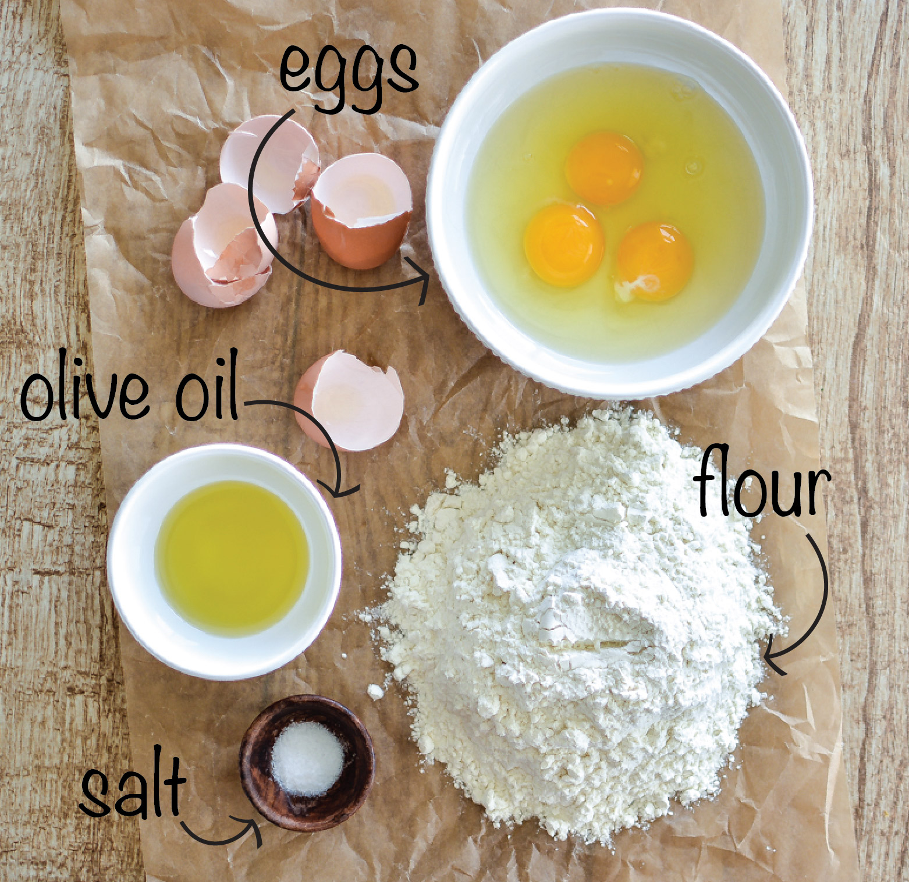
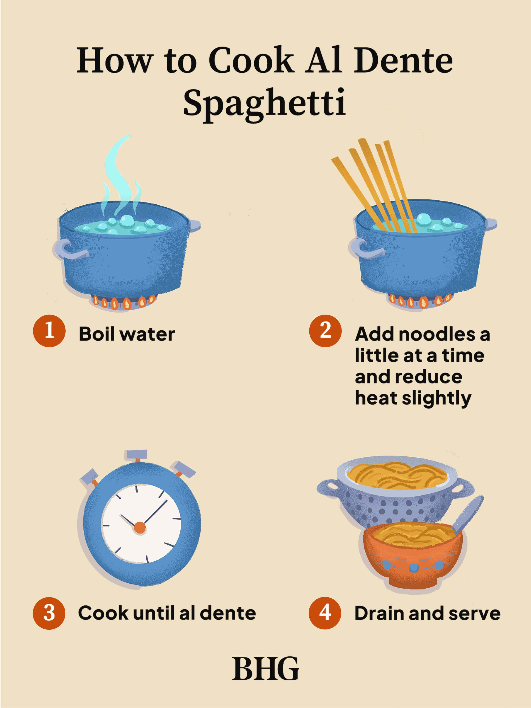
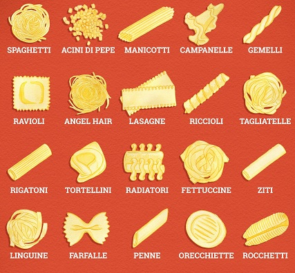

# Pasta Notes

## 1. How Pasta Is Made

### **Ingredients**

- Flour (usually semolina)
- Water
- Eggs (sometimes)
- Salt (optional)

### **Steps**

1. **Mixing:** Combine flour with water or eggs.
2. **Kneading:** Work the dough until smooth.
3. **Resting:** Let the dough sit so it's easier to shape.
4. **Shaping:** Roll or cut the dough into pasta shapes.
5. **Drying:** Some pasta is dried so it lasts longer.

---

## 2. Cooking Pasta

### **Boiling**

- Use a big pot of water.
- Add a good amount of salt.
- Wait for the water to boil, then add pasta.
- Stir sometimes so it doesn't stick.
- Cook until **al dente** (soft but still a little firm).

### **Cooking Times**

- **Fresh pasta:** 2–4 minutes.
- **Dry pasta:** 8–12 minutes depending on the shape.

### **Tips for Sauce**

- Save a little pasta water to help mix the sauce.
- Let the pasta cook in the sauce for the last minute for better flavor.

---

## 3. Storing Pasta

### **Fresh Pasta**

- Keep in the fridge up to 2 days.
- Can be frozen for longer.

### **Dry Pasta**

- Keep in a dry, cool place.
- Store in an airtight container.
- Lasts 1–2 years.

### **Cooked Pasta**

- Mix with a little oil so it doesn't stick.
- Store in a container in the fridge.
- Lasts 3–5 days.

---

## 4. Quality of Pasta

### **Good Dry Pasta**

- Made with durum wheat.
- Has a slightly rough surface.
- Holds its shape when cooked.

### **Bad Quality Signs**

- Pasta water becomes very cloudy.
- Pasta gets mushy fast.
- Cracks before cooking.

### **Good Fresh Pasta**

- Smooth dough.
- Even thickness.

---

## 5. Types of Pasta

- **Fresh:** Soft, usually made with eggs.
- **Dry:** Hard, long‑lasting.
- **Shapes:** Tubes (penne), ribbons (fettuccine), filled (ravioli), strings (spaghetti).

---

## 6. Common Mistakes

- Not enough salt in the water.
- Overcooking pasta.
- Rinsing pasta after cooking.
- Adding pasta before the water boils.

---

## 7. Helpful Tips

- Match pasta shapes with the right sauces.
- Taste pasta to check doneness.
- Use pasta water to fix or thin out the sauce.

---
